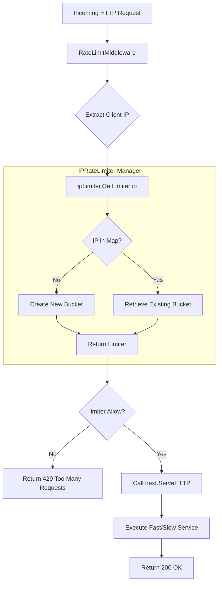

# Steady Stream Gateway

A high-performance API gateway built with Go, featuring per-IP rate limiting.

## Project Structure

### 1. `limiter.go` (The Logic)
Defines the architecture for traffic control:
*   **`Limiter` Interface**: Specifies the behavior for individual buckets (`Allow()` and `LastAccessed()`).
*   **`IPRateLimiter` Struct**: Manages a map of limiters, keyed by IP address.
*   **`RateLimitMiddleware`**: Intercepts HTTP requests to enforce rate limits based on the sender's IP.

### 2. `main.go` (The Server)
The entry point of the application:
*   **Services**: Includes `/api/fast` (10ms delay) and `/api/slow` (500ms delay) for testing.
*   **Router**: Uses `http.NewServeMux` for request routing.

### 3. `main_test.go` (The Validation)
Ensures implementation correctness and thread safety:
*   **Isolation**: Verifies that rate limits for one IP do not affect another.
*   **Middleware**: Confirms that the server correctly returns `429 Too Many Requests`.
*   **Concurrency**: Tests the system under simultaneous requests to ensure thread safety.

### 4. `.github/workflows/grade.yml` (The Automation)
Automated CI/CD pipeline:
*   **Unit & Race Tests**: Runs `go test -v -race ./...` to detect logic errors and data races.
*   **Load Testing**: Uses the `hey` tool to simulate 50 concurrent users for 5 seconds.

## Request Lifecycle Flowchart

The following flowchart illustrates how the `RateLimitMiddleware` handles an incoming request:



### Explanation of the Flow:
1.  **Request Arrival**: Every request to `/api/fast` or `/api/slow` first hits the `RateLimitMiddleware`.
2.  **IP Extraction**: The middleware identifies the sender via their IP address.
3.  **Bucket Management**: The `IPRateLimiter` checks its internal map. If it's a new IP, it initializes a new "bucket" (Limiter).
4.  **The Decision**: The specific bucket for that IP determines if the request is within the allowed rate.
5.  **Final Action**:
    *   **Allowed**: The request proceeds to the service logic.
    *   **Rate Limited**: The request is blocked with a `429 Too Many Requests` status.

## Getting Started

### Prerequisites

- Go 1.24 or later

### Running the server

```bash
go run main.go
```

The server will be available at `http://localhost:8080`.

### Running Tests

```bash
go test -v ./...
```
