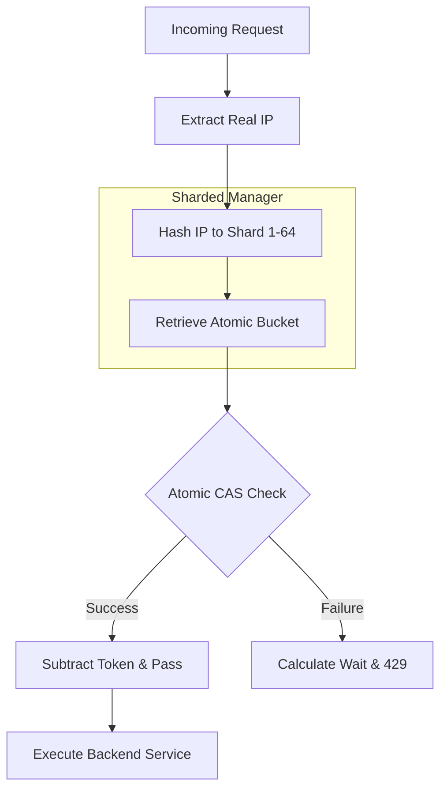

# Steady Stream Gateway

A production-grade, high-performance API gateway built with Go, featuring **Atomic GCRA** rate limiting and **Lock-Striping** for extreme concurrency.

## Advanced Architecture

### 1. Atomic GCRA (Leaky Bucket)
Instead of traditional mutex-based buckets, this gateway uses the **Generic Cell Rate Algorithm (GCRA)** implemented with `sync/atomic`.
*   **Lock-Free**: The `Allow()` operation uses `CompareAndSwapInt64`, eliminating mutex overhead and context switching.
*   **Sub-nanosecond Precision**: Tracks "theoretical arrival time" in nanoseconds for perfect rate accuracy.
*   **Predictive Backoff**: Returns the exact `Retry-After` duration to tell clients precisely when to try again.

### 2. Lock-Striping (Sharding)
The IP management layer is horizontally sharded into **64 independent shards**.
*   **Concurrency**: Requests from different IPs are hashed into different shards, allowing parallel processing across CPU cores without global lock contention.
*   **Non-Blocking GC**: Background cleanup sweeps shards one-by-one with micro-sleeps, preventing "Stop-The-World" latency spikes during memory reclamation.

### 3. Production Middleware
*   **Real IP Detection**: Correct-handling of `X-Forwarded-For` headers for environments behind Nginx, AWS, or Cloudflare.
*   **Standard Headers**:
    *   `X-RateLimit-Limit`: Maximum burst capacity.
    *   `X-RateLimit-Remaining`: Current tokens left for the IP.
    *   `Retry-After`: Seconds to wait (sent on 429).

## Request Lifecycle Flowchart



## Getting Started

### Prerequisites
- Go 1.24 or later

### Running the server
```bash
go run main.go
```

### Running Tests (Highly Recommended)
```bash
go test -v ./...
```
