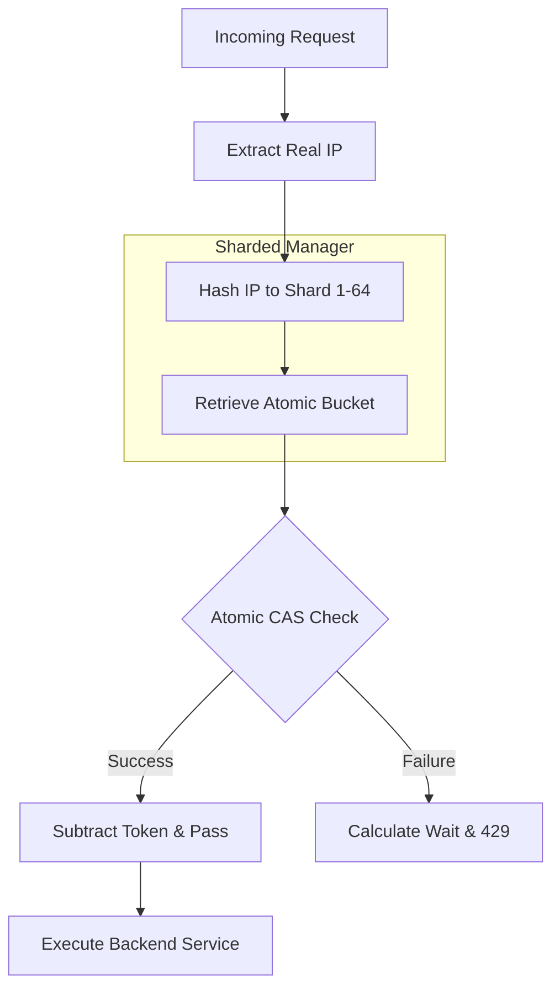

# 🏆 Steady Stream API Gateway

[](https://github.com/shubham217/golang_hackathon/actions/workflows/grade.yml)

An ultra-high-performance API Gateway built in Go, featuring a **Lock-Free Per-IP Leaky Bucket** implementation. This gateway acts as a "steady stream" regulator, transforming bursty, unpredictable traffic into a constant, manageable flow for downstream microservices.

## 🚀 Key Features

* **GCRA (Generic Cell Rate Algorithm)**: A mathematically optimized, lock-free version of the Leaky Bucket. It uses atomic `CompareAndSwap` (CAS) to eliminate mutex contention.
* **Zero-Background Leak Logic**: Unlike traditional implementations, this "leaks" mathematically upon request arrival—no expensive background tickers required for individual buckets.
* **Per-IP Isolation**: Protects against noisy neighbors and DDoS by tracking unique IP addresses with a thread-safe sharding strategy.
* **Memory Leak Protection**: Implements an active background "sweeper" that purges stale IP buckets after 5 minutes of inactivity.
* **Standard Library Only**: Built with 100% Go standard library—no external dependencies.

## 🧠 Technical Deep Dive: GCRA

The gateway utilizes the **Generic Cell Rate Algorithm (GCRA)**. Instead of tracking water levels, we track the **Theoretical Arrival Time (TAT)**.

1.  **Arrival**: When a request hits the gateway, we calculate the next available "slot" ($TAT + Interval$).
2.  **Compliance**: If the required wait time ($TAT - now$) exceeds the allowed **Burst Tolerance**, the request is rejected with `HTTP 429`.
3.  **Atomic Update**: We use `sync/atomic` to update the $TAT$ variable, ensuring that thousands of concurrent requests can be processed with nanosecond latency.

## 📊 Request Lifecycle Flowchart

The following flowchart illustrates how the `RateLimitMiddleware` handles an incoming request using the sharded manager and atomic buckets:



## 🚦 Getting Started

### Prerequisites
* **Go**: v1.24+
* **Load Tester**: `hey`
    ```bash
    go install github.com/rakyll/hey@latest
    ```

### Installation
```bash
git clone https://github.com/shubham217/golang_hackathon.git
cd golang_hackathon/steady-stream-gateway
go run .
```

### Running Tests
```bash
go test -v ./...
```
